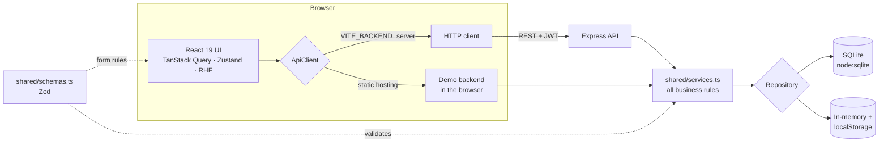

# Flowboard: capstone project

Flowboard is a full-stack project and task manager. It's the capstone of the
[Long Term Internship](../README.md) roadmap and brings the 41 practice tasks
together into one working product.

**Live demo:** https://piyushdwivedi2901.github.io/Long-Term-Internship/flowboard/
To try it, choose **Explore with sample data** on the sign-in screen.

The idea: every project is a *line* with its own colour, and every task travels
along it through four stations: To do → In progress → In review → Done.

## Features

- **Accounts.** Sign up, sign in and sign out. Sessions are restored on reload,
  and expired sessions sign you out cleanly. You can delete your account after
  confirming your password.
- **Dashboard.** It shows:
  - a "line map" of each project's progress
  - tasks that need attention (overdue and due soon)
  - a 14-day completion chart
  - an activity feed
- **Kanban board per project.** You can drag cards with the mouse, touch or
  keyboard. With the keyboard, press Space to lift a card, use the arrow keys
  to move it, and press Space to drop it. Every step is announced to screen
  readers. Moves are optimistic and roll back if the server refuses them.
- **Task details drawer.** Edit title, priority, due date, labels and notes. A
  status switch, checklist, comments and delete are also there. It's deep
  linkable with `?task=<id>`.
- **My tasks.** All tasks across projects, grouped as Overdue, Today, Next 7
  days, Later and No date. You can filter them by project, status, priority and
  due date. Filters live in the URL, so a filtered view can be shared or
  bookmarked. Completing a task can be undone from the toast.
- **Command palette** (Ctrl/⌘ K). Jump to any project or task, or run an
  action.
- **Shortcuts.** Press **C** for a new task.
- **Settings.**
  - Profile
  - Light, dark or system theme
  - JSON export of your data
  - Shortcut list
- **Accessibility.** Every screen passes axe-core with 0 violations in light
  and dark themes, including colour contrast. Dialogs trap and restore focus,
  live regions announce changes, and reduced motion is respected.
- **Responsive** down to phone widths, with a slide-in navigation drawer.

## Architecture



All rules live in `shared/`:

- **Validation:** the Zod schemas.
- **Business logic:** ownership checks, column ordering, activity log and stats,
  all in `services.ts`.

Two things run that same code:

1. **The Express server** (`server/`) puts it behind a REST API with scrypt
   password hashing, signed JWTs, rate limiting and security headers. It stores
   data in SQLite.
2. **The demo backend** (`src/api/demo.ts`) runs it inside the browser and
   stores data in localStorage, with PBKDF2 password hashing. This is what the
   static GitHub Pages deployment uses, because Pages can't run a server.

A contract test (`src/api/contract.test.ts`) runs the same scenarios against
both, so they can't drift apart.

```
capstone/
  shared/     schemas, types, services, repository interface, in-memory repository
  server/     Express app, SQLite repository, scrypt + JWT, entry point
  src/        React app — api/, auth/, features/ (board, tasks, palette, shell), pages/, ui/
  e2e/        Playwright tests (demo build + production server)
```

## How the roadmap tasks show up here

| Roadmap tasks | Where in Flowboard |
|---|---|
| 1–4 components, props, lists, conditional rendering | `ui/bits.tsx` (`PriorityTag`, `DueChip`, `LineDot`), every list and empty state |
| 5–8 state, forms, to-do list | Task creation, checklist, inline editing |
| 9–12 effects, fetching, loading and error states | Session restore, `PageLoading`, per-query error states, retry rules |
| 11, 14 search/filter, custom hooks | `useDebounce`, `useHotkey`, board and My tasks filters |
| 13, 15 lifting state, Context | `AuthProvider`, `ThemeProvider` |
| 16–17 routing, dynamic routes | Hash router, `/projects/:projectId`, `?task=` deep links, 404s |
| 18, 38 form validation, React Hook Form + Zod | All forms, using the schemas shared with the server |
| 20, 32 cart / portals | `Modal` (portal, focus trap) for dialogs, drawer and command palette |
| 23, 33 Kanban, accessibility | `features/board` (dnd-kit, keyboard moves, live announcements) |
| 24, 28 Zustand, typed store | `lib/uiStore.ts` (toasts, palette, global dialogs) |
| 25, 39 testing, E2E | Vitest + Testing Library, API contract tests, Playwright suites |
| 26, 30, 40, 41 performance, code splitting, Lighthouse, bundles | Lazy routes and shell, small sign-in bundle, Lighthouse 95 / 100 / 100 / 100 |
| 27 TypeScript | Strict TypeScript everywhere, including the server (run with Node's type stripping) |
| 29 error boundaries | Route-level boundary that recovers on navigation; stale-deploy chunk errors offer a reload |
| 31 compound components | Board → Column → card composition with shared drag context |
| 34 animation | framer-motion for the drawer, dialogs, toasts and list changes; CSS for the sign-in route map |
| 35–37 backend, auth, TanStack Query | Express + SQLite, scrypt/JWT, optimistic mutations with rollback |

## Running it

Requires **Node 22.18+**, which runs the TypeScript server directly.

```bash
cd capstone
npm install
npm run dev          # frontend with the in-browser demo backend → http://localhost:5180/Long-Term-Internship/flowboard/
npm run dev:full     # frontend + Express/SQLite API (Vite proxies /api to :4000)
```

| Script | What it does |
|---|---|
| `npm test` | 52 unit, API, contract and UI integration tests (Vitest) |
| `npm run test:e2e` | 10 Playwright tests against the static build *and* the production server |
| `npm run typecheck` | Strict `tsc` over client, server, shared code and tests |
| `npm run build` | Static build for GitHub Pages (demo backend) |
| `npm run build:server` + `npm start` | Production build served by Express on one origin |

### Environment variables (server)

| Variable | Default | Notes |
|---|---|---|
| `JWT_SECRET` | random per boot in dev | **Required** when `NODE_ENV=production` |
| `DB_FILE` | `flowboard.sqlite` | Use a persistent volume in production |
| `PORT` | `4000` | |
| `CORS_ORIGIN` | `http://localhost:5180` | Comma-separated allow-list; not needed when the server hosts the frontend |
| `STATIC_DIR` | `dist-server` in production | Built frontend to serve |

## Deploying the real backend

The GitHub Pages deployment runs on the demo backend, so each visitor's data
stays in their own browser. To run Flowboard with a shared database:

- **Render.** `render.yaml` at the repo root is a one-click Blueprint
  (New → Blueprint). It builds `capstone/Dockerfile`, generates `JWT_SECRET`
  and mounts a disk for SQLite. Persistent disks need a paid Render plan.
- **Docker anywhere:**
  ```bash
  docker build -t flowboard capstone
  docker run -p 4000:4000 -e JWT_SECRET=$(openssl rand -hex 32) -v flowboard-data:/data flowboard
  ```

## Security notes

- Passwords are hashed with scrypt and a per-user salt. Hashes are never
  returned by the API.
- Tokens are HS256 JWTs with a 7-day expiry. Forged, expired and `alg: none`
  tokens are rejected (tested).
- Every query is scoped to the signed-in user in one place (`services.ts`).
  Cross-user access returns 404, and this is tested.
- All SQL uses bound parameters. Request bodies are capped at 64 kB and
  validated by Zod.
- Sign-in and sign-up are rate-limited per IP.
- Responses carry `nosniff`, `X-Frame-Options: DENY` and a strict referrer
  policy. CORS is limited to an allow-list.

## Known limitations

- Accounts are single-user: there are no shared workspaces or invitations yet.
- The rate limiter and SQLite both assume a single server instance. Scaling
  out would need a shared store such as Redis or Postgres.
- In demo mode, data lives in one browser's localStorage, and clearing site
  data removes it. The demo's password hashing protects against casual
  inspection, not against someone with access to that browser.
- The Docker image and Render blueprint follow the tested production path
  (`build:server` + `node server/index.ts` with only production dependencies),
  but the image itself wasn't built in the development environment.
